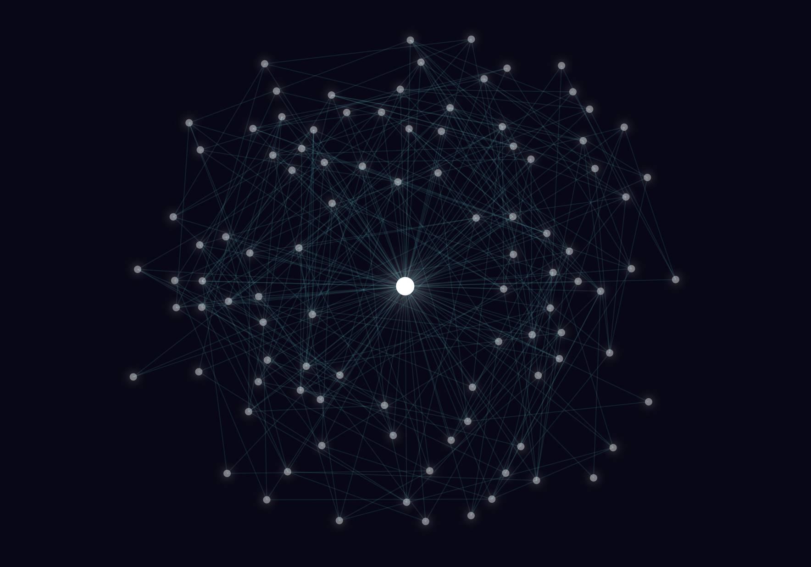
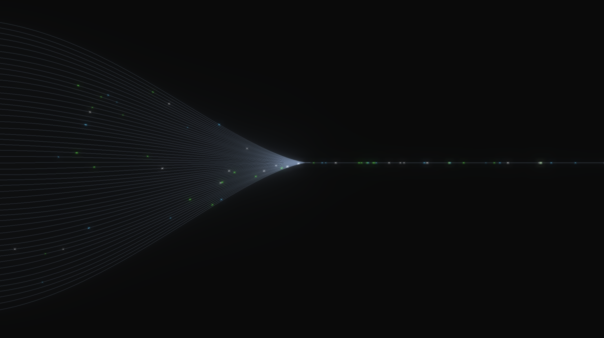

# Rendu 2 - Point(s) tech
*Conception et Prototypage*

---

J'ai exploré 3 différents points tech (indépendants) pour mon projet. L'objectif était d'expérimenter avec des solutions techniques afin de mettre en forme des élements visuels en rapport avec mon intention de projet.

## 1 - Force-driven Graph w/ D3.js

Pour la première fois, j’ai utilisé la librairie D3.js, car elle permet de créer des visualisations interactives adaptées à mon projet.
J’ai choisi un Force-Directed Graph pour représenter un cluster de données autour d’un nœud central, avec chaque élément connecté aux autres par des liens.

Cette visualisation pourrait m’aider à explorer et présenter les relations entre les données de manière  visuelle et dynamique (aussi interactive), comme le déplacement des nœuds ou l’affichage d’informations supplémentaires au survol.

##### Le Force-Driven Graph (D3.js)

Un force-directed graph est un type de visualisation de réseau où les nœuds et les liens sont disposés automatiquement selon des forces physiques simulées :

↳ Force de répulsion : chaque nœud repousse les autres pour éviter qu’ils ne se chevauchent.

↳ Force de lien : chaque lien agit comme un ressort, rapprochant les nœuds connectés.

↳ Force de centrage : recentre le graphe pour qu’il reste visible dans le canva.

Grâce aux forces, le graphe se réorganise dynamiquement pour trouver une position stable. 

Dans ce code, les nœuds sont **interactifs** : on peut les faire glisser avec la souris, et la simulation s’adapte en temps réel.
Chaque nœud peut aussi avoir une couleur ou un titre.

##### À propos de D3.js
D3.js (Data-Driven Documents) est une bibliothèque JavaScript puissante qui permet de créer des visualisations interactives basées sur des données dans le navigateur.
Elle fonctionne en liant des données aux éléments du DOM et en appliquant des transformations dynamiques (position, couleur, taille, etc.).
D3 fournit aussi de nombreux outils pour les échelles, axes, formes et animations, ce qui la rend très flexible pour les graphiques, cartes et diagrammes.

# 2 - Data Tunnel (three.js)

J’ai également voulu tester Three.js, en partant d’un projet existant (codepen.io), pour évaluer si cette librairie pouvait être utile dans mon projet et à quel point elle est manipulable.

##### Three.js

Three.js permet de créer des scènes 3D interactives dans le navigateur, ce qui offre un niveau d’immersion et de visualisation difficile à obtenir avec des bibliothèques 2D comme D3.js.

Grâce à elle, je pourrais explorer des représentations plus complexes et immersives des données, intégrer des animations 3D, et permettre à l’utilisateur de naviguer autour des éléments de manière libre, offrant ainsi une expérience plus visuelle et engageante que les graphiques classiques en 2d

# 3 - Text scramble effect (GSAP w/ Scroll Trigger)

J'ai ensuite voulu expérimenter avec un effet rappelant l'univers de la donnée, de la metadata à travers une animation touchant à la typographie. Pour mon projet, le text scramble permet de représenter la transformation d'un message : de son état "codé" ou fragmenté, jusqu'à son texte lisible. Cette expérience traduit visuellement la manière dont les informations brutes (symboles,métadonnées...) se structurent et deviennent compréhensibles, en lien direct avec mon projet sur les flux et traitements des données utilisateur·ices.

J'ai trouvé pertinent (pour une appriche scrolly telling) de jouer sur le scroll pour réveler de l'information.

##### Fonctionnement 

Texte brouillé au départ : chaque caractère du texte final est remplacé par un symbole aléatoire, créant un chaos visuel.

↳ Animation au scroll : la position dans la section détermine la progression de l’animation (GSAP ScrollTrigger).

↳ Révélation progressive : les caractères se transforment un par un du symbole aléatoire au vrai caractère selon la progression.

↳ Effet visuel : le texte se débrouille progressivement, du haut vers le bas, de façon fluide grâce au scrub: 1.5 qui synchronise l’animation avec le scroll.